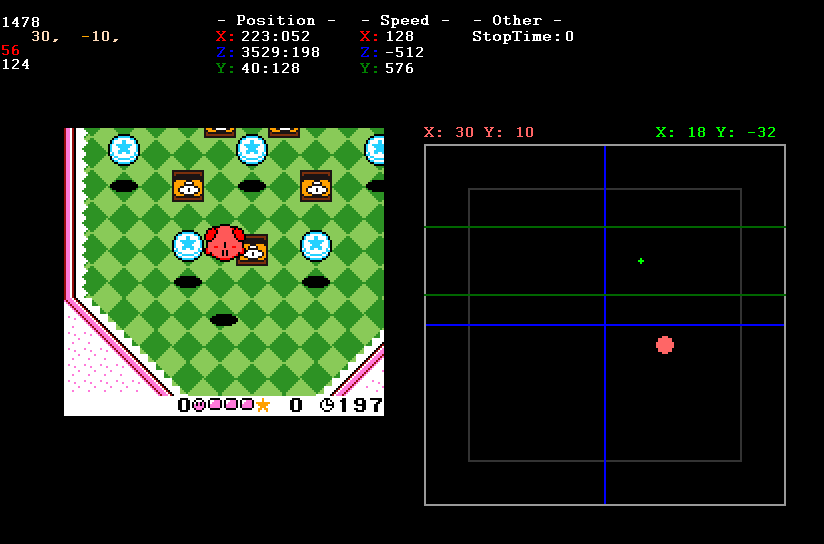

# Kirby Tilt 'n' Tumble: Lua for TAS
Script optimized for TAS. It has the following features:
- Various memory watches
- Tilt input for convenience

## Memory watches
The current version has a memory for Kirby's position and speed, and a separate item for the time it takes for Kirby to enter the waiting motion. X and Z represent the horizontal and vertical axes parallel to the ground, and Y represents the axis perpendicular to the ground.

Position memory concatenates pixel positions with sub-pixel(0-255) positions.

## Tilt Input
Tilt Input allows for tilt input by mouse click, arrow keys, or numeric keypad. With the movie loaded, the Tilt input of the previous frame is also displayed.

### Keypad 1-9
Moves the Tilt point to the edge of the specified range according to the keypad direction. Keypad 5 moves the Tilt point to the center (0,0).

During movie loading, movement stops at the non-pop line defined by the Tilt point of the previous frame. In this case, pressing the same key again will move the movie to the end of the range via the non-pop line.

### Keypad 0
Moves the Tilt point to the same position as the Tilt point in the previous frame. Note: This is only valid during movie loading.

### Arrow keys
Move the Tilt input by 1 in the direction of the arrow keys.

### Tilt input of previous frame
While the movie is loading, the Tilt point of the previous frame is displayed. By default, it is a small green dot. The two lines above and below the point are anti-pop lines. If the Tilt input in the next frame exceeds these lines, Kirby will pop.

## Other
- A minimum window size of 2x is recommended. It will be automatically adjusted when the script is loaded.
- It works with BizHawk version 2.8 or higher. Earlier versions have not been tested.
- The core only works with Gambatte (SameBoy); Tilt input is not possible with GBHawk.